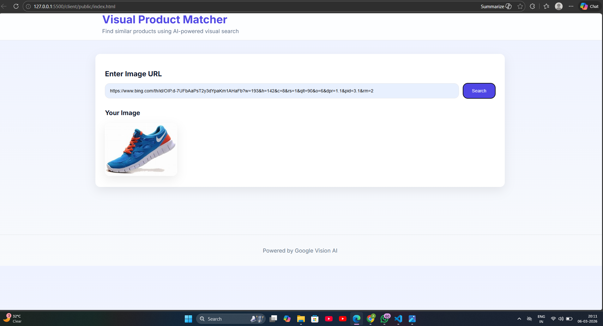
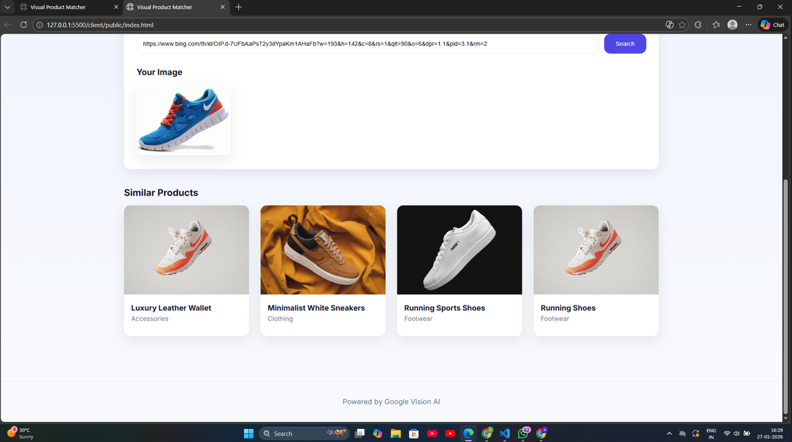

# 👁️ Drishti
> **AI-powered visual product matching system using image recognition**


## 🌐 Live Demo

🔗 **Live Website:** https://drishti-visual-product-matcher.onrender.com


---

## 📸 Application Demo

| Search Interface                 | Product Results                   |
| -------------------------------- | --------------------------------- |
|  |  |


## 📖 Overview

**Drishti** is a full-stack web application that enables users to discover visually similar products by submitting an image URL.  
The system leverages the **Google Cloud Vision API** to extract meaningful visual labels from images and matches them against a curated product catalog stored in **Firebase Firestore**.

This project demonstrates the real-world application of **Artificial Intelligence**, **Cloud APIs**, and **modern full-stack web development**.

---

## 🚀 Features

- 🔗 Image URL–based product search  
- 🤖 AI-powered image labeling using Google Vision API  
- 🧠 Intelligent product matching using semantic tags  
- 🗃️ Cloud-hosted product database (Firebase Firestore)  
- 🔐 Secure backend proxy for API key protection  
- 🎨 Clean, modern, and responsive user interface  

---

## 🧩 System Architecture

User (Browser) <br>
↓<br>
Frontend (HTML / CSS / JavaScript)<br>
↓<br>
Node.js + Express (API Proxy Server)<br>
↓<br>
Google Cloud Vision API<br>
↓<br>
Firebase Firestore (Product Database)<br>


---

## 🛠️ Technology Stack

### Frontend
- HTML5  
- CSS3  
- JavaScript (ES Modules)

### Backend
- Node.js  
- Express.js  

### Cloud Services
- Google Cloud Vision API  
- Firebase Firestore  

### Tools & Platforms
- GitHub  
- Render (Deployment)  
- dotenv (Environment Variable Management)

---

## 📁 Project Structure

```
drishti/
│
├── client/
│   └── public/
│       ├── index.html      # Application UI
│       ├── styles.css      # Styling
│       └── app.js          # Frontend logic
│
├── server.js               # Backend server & API proxy
├── products.json           # Product dataset (50+ items)
├── package.json            # Project dependencies
├── .env                    # Environment variables (not uploaded to GitHub)
└── README.md               # Project documentation
```


---

## ⚙️ Installation & Setup

### 1️⃣ Clone the Repository
```bash
git clone https://github.com/your-username/drishti.git
cd drishti
2️⃣ Install Dependencies
npm install
3️⃣ Configure Environment Variables
Create a .env file in the project root:

GOOGLE_VISION_API_KEY=your_google_vision_api_key
4️⃣ Start the Server
npm start
5️⃣ Open the Application
http://localhost:3000
 ```

## 🔍 How It Works

* User submits an **image URL**
* Backend sends the image to **Google Vision API**
* Vision API returns descriptive **visual labels**
* Labels are matched with **product tags stored in Firestore**
* Visually similar products are displayed to the user

---


## 📦 Product Dataset

Contains **50+ unique products**

Each product includes:

* Product name
* Category
* Image URL
* AI-generated semantic tags

---

## 🔐 Security Design

* API keys are **never exposed to the frontend**
* All API requests are handled through a **secure backend proxy**
* Sensitive credentials are managed using **environment variables**

---

## ⚡ Performance Considerations

* Product data is loaded **once from Firestore**
* Matching is performed **in-memory for fast responses**
* Minimal frontend dependencies for improved performance

---

## 🚀 Future Enhancements

* Image file upload support
* Similarity score filtering
* Category-based filtering
* User authentication

---

## 🎓 Academic Context

This project demonstrates:

* AI and cloud API integration
* Cloud-based application architecture
* Full-stack web development skills
* Secure backend system design

---

## 👨‍💻 Author

**Abhishek Pandey**
Computer Science Student

---

## 📜 License

This project is intended for **educational purposes only**.

---

## ✅ Project Status

✔ Functional
✔ Tested
